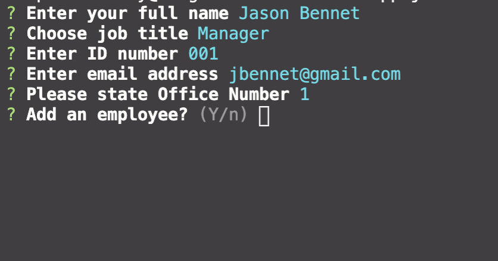
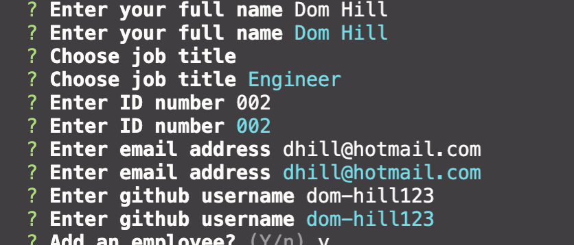
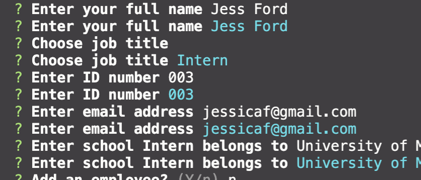
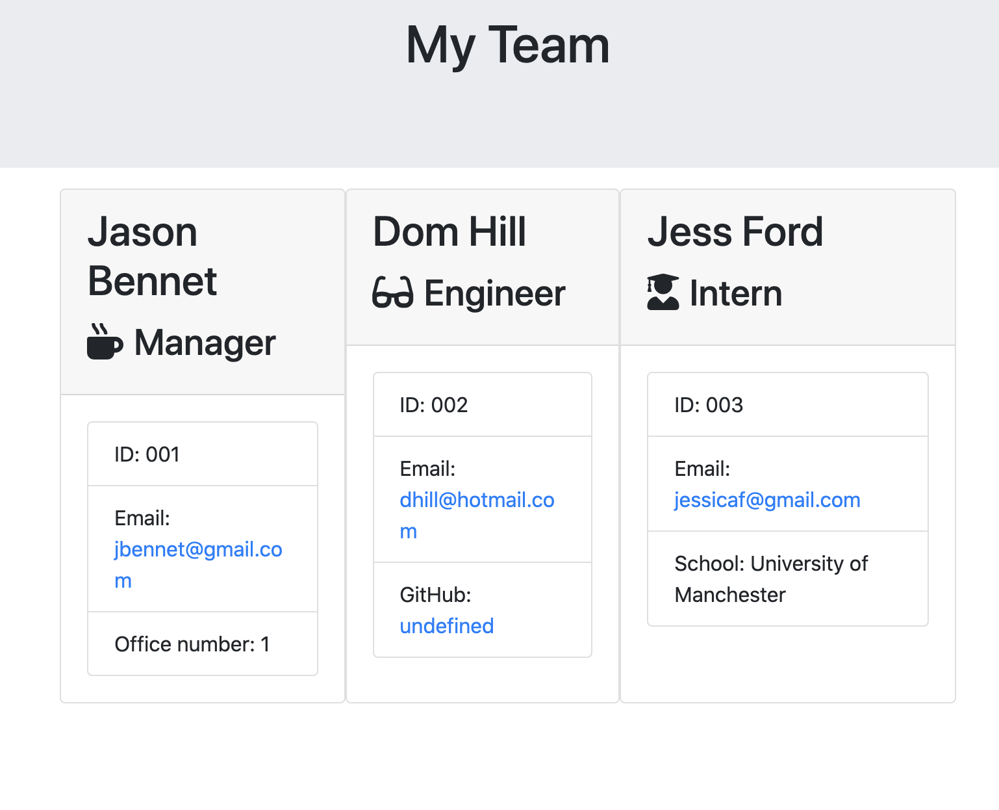

# Software Engineering Template Generator

## Description

A Node CLI that takes in users information about employees and from that renders a HTML summary of the team members so details can be easily accessed

## Table of Contents

- [Installation](#installation)
- [Usage](#usage)
- [Tests](#tests)
- [License](#license)
- [Contributing](#contributing)

## Installation

To install all relevant dependencies for this project, run

    npm install

## Usage

To use this project firstly ensure you are within the src folder then run,

    node app.js

## Screenshots

- User is first prompted with questions related to Manager of the project

- Users prompted questions if Engineer is selected at role

- Users prompted questions if Intern is selected at role

- Display output in HTML after all team information has been inputted

## License

ISC License

Copyright (c) [2020], [Stephanie Morrissey]

Permission to use, copy, modify, and/or distribute this software for any
purpose with or without fee is hereby granted, provided that the above
copyright notice and this permission notice appear in all copies.

THE SOFTWARE IS PROVIDED "AS IS" AND THE AUTHOR DISCLAIMS ALL WARRANTIES
WITH REGARD TO THIS SOFTWARE INCLUDING ALL IMPLIED WARRANTIES OF
MERCHANTABILITY AND FITNESS. IN NO EVENT SHALL THE AUTHOR BE LIABLE FOR
ANY SPECIAL, DIRECT, INDIRECT, OR CONSEQUENTIAL DAMAGES OR ANY DAMAGES
WHATSOEVER RESULTING FROM LOSS OF USE, DATA OR PROFITS, WHETHER IN AN
ACTION OF CONTRACT, NEGLIGENCE OR OTHER TORTIOUS ACTION, ARISING OUT OF
OR IN CONNECTION WITH THE USE OR PERFORMANCE OF THIS SOFTWARE.

## Contributing

When contributing to this repository, please first discuss the change you wish to make via issue, email, or any other method with the owners of this repository before making a change.

1. Fork
2. Clone and setup
   git clone
   https://github.com/steph-morrissey/software-engineers-template-generator
3. Develop
4. Pull request

## Tests

    npm run test

## Credits

Stephanie Morrissey - <https://github.com/steph-morrissey>
